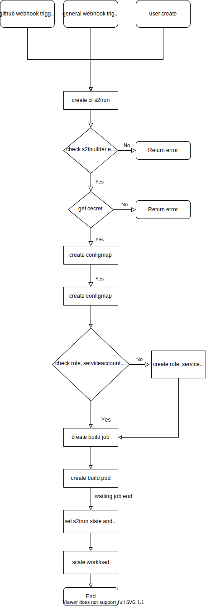

# S2I Operator

In S2I, all resource and (CI/CD) steps are defined with Custom Resource Defintion(CRD). Put another way, you can operate all s2i resource by call k8s api directly. In the case of [KubeSphere](https://github.com/kubesphere/kubesphere), this makes it easy to encapsulate configuration into `s2ibuilders` and `s2ibuildertemplates`.

Following CRD will be used in S2I :

1. s2ibuildertemplates: defines information about S2I builder image.
2. s2ibuilders: all configuration information used in building are stored in this CRD.
3. s2iruns: defines an action about build

Here is a Architecture  to figout relationship about all CRD:


For developer who are interested in S2IRun, please read [doc](https://github.com/kubesphere/s2irun#s2irun) about details.

## CRD

Below is the spec defined for the CR `s2ibuildertemplates`:

```yaml
# DefaultBaseImage is the image that will be used by default
defaultBaseImage: imagename

# ContainerInfo is the image information this template will use.
ContainerInfo: 
  - builderImage: builderImage
    runtimeImage: runtimeImage
    runtimeArtifacts:
      - source: "/deployments"
    buildVolumes: ["volumeName:/tmp/artifacts"]
# CodeFramework means which language this template is designed for and which framework is using if has framework. Like Java, NodeJS etc 
codeFramework: java

# Parameters is a set of environment variables to be passed to the image.
environment:
  - key: name
    type: string
    description: "description"
    required: false
    defaultValue: ""
    optValues: ["",""]
    value: value

# Version of template
version: 1.0

# Description illustrate the purpose of this template
description: "description"

# IconPath is used for frontend display
iconPath: "iconPath"
```


Below is the spec defined for the CR `s2ibuilders`:

```yaml
config:
  # BuildVolumes specifies a list of volumes to mount to container running the build.
	buildVolumes: ["volumeName:/tmp/artifacts"]
	
	# BuilderImage describes which image is used for building the result images.
	builderImage: builderImage
	
	# RuntimeImage specifies the image that will be a base for resulting image and will be used for running an application. By default, BuilderImage is used for building and running, but the latter may be overridden.
	runtimeImage: runtimeImage
	
	# RuntimeArtifacts specifies a list of source/destination pairs that will be copied from builder to a runtime image. Source can be a file or directory. Destination must be a directory. Regardless whether it is an absolute or relative path, it will be placed into image's WORKDIR. Destination also can be empty or equals to ".", in this case it just refers to a root of WORKDIR.
	runtimeArtifacts: 
		# Source is a reference to the volume source.
	  - source: sourcePath
	  # Destination is the path to mount the volume to - absolute or relative.
	    Destination: destinationPath
	  # Keep indicates if the mounted data should be kept in the final image.
	    Keep: bool
	    
	# BuilderPullPolicy specifies when to pull the builder image.
	builderPullPolicy: if-not-present
	
	# Specify a relative directory inside the application repository that should be used as a root directory for the application.
	contextDir: /
	
	# ImageName Contains the registry address and reponame, tag should set by field tag alone
	imageName: imageName
	
	# Export Push the result image to specify image registry in tag
	export: bool
	
	# Whether output build result to status.
	outputBuildResult: bool
	
	# PullAuthentication holds the authentication information for pulling the Docker images from private repositories
	pushAuthentication: 
		username: username
		password: password
		serverAddress: serverAddress
		
	# The RevisionId is a branch name or a SHA-1 hash of every important thing about the commit	
	revisionId: master
	
	# SourceURL is  url of the codes such as https://github.com/a/b.git
	sourceUrl: sourceUrl
	
	# Tag is a result image tag name.
	tag: imageTag
	
	# IsBinaryURL explain the type of SourceURL. If it is IsBinaryURL, it will download the file directly without using git.
	isBinaryURL: bool
	
	# GitSecretRef is the BasicAuth Secret of Git Clone
	gitSecretRef: secret
```

Below is the spec defined for the CR `s2iruns`:

```yaml
# BuilderName specify the name of s2ibuilder, required
builderName: s2ibuilderName

# BackoffLimit limits the restart count of each s2irun. Default is 0
backoffLimit: 0

# SecondsAfterFinished if is set and greater than zero, and the job created by s2irun become successful or failed , the job will be auto deleted after SecondsAfterFinished
secondsAfterFinished: 0

# NewTag override the default tag in its s2ibuilder, image name cannot be changed.
newTag: newTag

# NewRevisionId override the default NewRevisionId in its s2ibuilder.
newRevisionId: newRevisionId

# NewSourceURL is used to download new binary artifacts
newSourceURL: newSourceURL
```

## Reconcile flow



